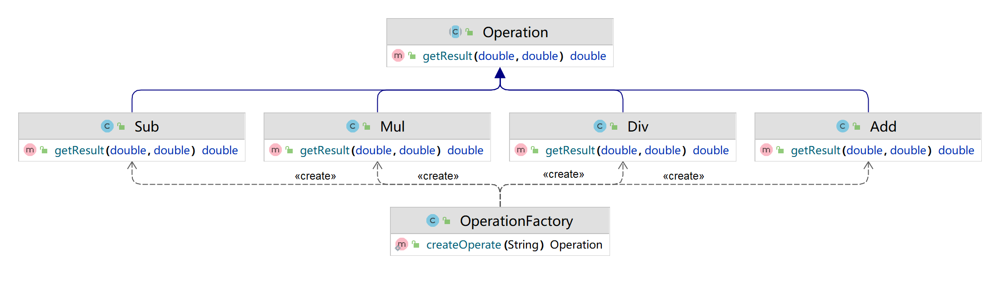

# 第1章 简单工厂模式

## 引子：

> 使用任意一种面向对象语言，实现一个计算器控制台程序，要求输入`两个数` 和 `运算符号` ，得到结果


## 一种很烂的写法：

```java
import java.util.Scanner;

/**
 * 最low版写法：
 * ------------
 * 所有的代码都写在客户端，且代码不规范
 */
public class Test1 {
    public static void main(String[] args) {
        Scanner sc = new Scanner(System.in);
        System.out.println("请输入数字A：");
        // A\B\C\D变量命名不规范
        String A = sc.nextLine();
        System.out.println("请选择运算符号(+、-、*、/)：");
        String B = sc.nextLine();
        System.out.println("请输入数字B：");
        String C = sc.nextLine();
        double D = 0d;

        // 判断分支，每个条件都要判断，等于做了三次无用功
        if (B.equals("+")) {
            D = Double.parseDouble(A) + Double.parseDouble(C);
        }
        if (B.equals("-")) {
            D = Double.parseDouble(A) - Double.parseDouble(C);
        }
        if (B.equals("*")) {
            D = Double.parseDouble(A) * Double.parseDouble(C);
        }
        if (B.equals("/")) {
            // 大量重复的Double.parseDouble()代码，且除数可能为0，没有容错判断
            D = Double.parseDouble(A) / Double.parseDouble(C);
        }
        System.out.println("结果是：" + D);
    }
}
```


## 基础优化点：

1、 变量命名规范

2、判断分支优化

3、大量重复的Double.parseDouble()代码，可以提前处理

4、除法<u>***最优先考虑***</u>的除数为0判断


## 简单工厂模式 - UML类图：

