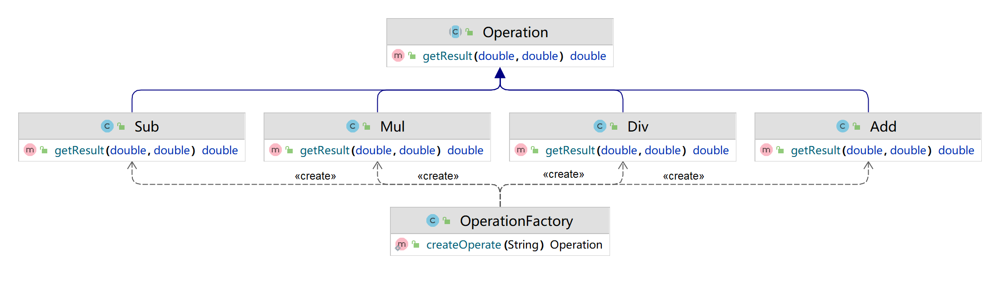

# 第1章 简单工厂模式

## 引子

> 使用任意一种面向对象语言，实现一个计算器控制台程序，要求输入`两个数` 和 `运算符号` ，得到结果


## 小白の实现（很烂）

```java
import java.util.Scanner;

/**
 * 最low版写法：
 * ------------
 * 所有的代码都写在客户端，且代码不规范
 */
public class Test1 {
    public static void main(String[] args) {
        Scanner sc = new Scanner(System.in);
        System.out.println("请输入数字A：");
        // A\B\C\D变量命名不规范
        String A = sc.nextLine();
        System.out.println("请选择运算符号(+、-、*、/)：");
        String B = sc.nextLine();
        System.out.println("请输入数字B：");
        String C = sc.nextLine();
        double D = 0d;

        // 判断分支，每个条件都要判断，等于做了三次无用功
        if (B.equals("+")) {
            D = Double.parseDouble(A) + Double.parseDouble(C);
        }
        if (B.equals("-")) {
            D = Double.parseDouble(A) - Double.parseDouble(C);
        }
        if (B.equals("*")) {
            D = Double.parseDouble(A) * Double.parseDouble(C);
        }
        if (B.equals("/")) {
            // 大量重复的Double.parseDouble()代码，且除数可能为0，没有容错判断
            D = Double.parseDouble(A) / Double.parseDouble(C);
        }
        System.out.println("结果是：" + D);
    }
}
```


## 小白の优化点

1、 变量命名规范

```java
A --> numberA		// 数字A
B --> strOperate	// 运算符
C --> numberB		// 数字B 
D --> result 		// 结果
```

2、判断分支优化

```java
switch(strOperate){
    case "+":
        result = numberA + numberB;
		break;
    
    ...
}

System.out.println("结果是：" + result);
```

3、大量重复的Double.parseDouble()代码，可以提前处理

```java
System.out.println("请输入数字A：");
double numberA = Double.parseDouble(sc.nextLine());
```

4、除法<u>***最优先考虑***</u>的除数为0判断

```java
if (numberB == 0) {
    System.out.println("除数不能为0");
    throw new ArithmeticException();
}
```

5、异常捕获

```java
try {
    Scanner sc = new Scanner(System.in);
    System.out.println("请输入数字A：");
    double numberA = Double.parseDouble(sc.nextLine());

    // ... 正常流程
    System.out.println("结果是：" + result);
} catch (Exception e) {
    // 输入有误
    System.out.print("您的输入有误：");
    e.printStackTrace();
}
```

6、改为面向对象编程

### 6.1 业务的封装

用一个Operation运算类，提供getResult方法，传入运算数字和符号，进行switch分支判断，return result

优点：业务逻辑与界面逻辑分开

缺点：

- **新增**指数运算、平方根运算，写进switch分支判断，这样加减乘除的运算都要参与编译，万一原有代码出现改动……

- 新增薪资计算业务逻辑，原有的运行代码都被暴露，很容易被注入新的**不安全**代码

  ```java
  if (条件) {
      // 私自增加薪水
      salary = salary * 1.1;
  }
  ```

### 6.2 继承

**抽象出**一个父类【运算类】Operation，加减乘除都是运算类的子类

这样把加减乘除等运算**分离**，修改其中一个不影响另外的几个


## 简单工厂模式

### UML类图



父类：运算类Operation

子类：具体的运算法则类（Add、Sub、Mul、Div）

**简单运算工厂类：OperationFactory**，只需要输入运算符号，工厂就能实例化出合适的对象，**通过多态**，返回父类的方式实现了计算器的结果

```java
public class OperationFactory {
    public static Operation createOperate(String operate) {
        Operation oper = null;
        switch (operate) {
            case "+":
                oper = new Add();
                break;
            case "-":
                oper = new Sub();
                break;
            case "*":
                oper = new Mul();
                break;
            case "/":
                oper = new Div();
                break;
        }
        return oper;
    }
}
```

最终版本的客户端：

```java
Operation oper = OperationFactory.createOperate(strOperate);
double result = oper.getResult(numberA, numberB);
```

